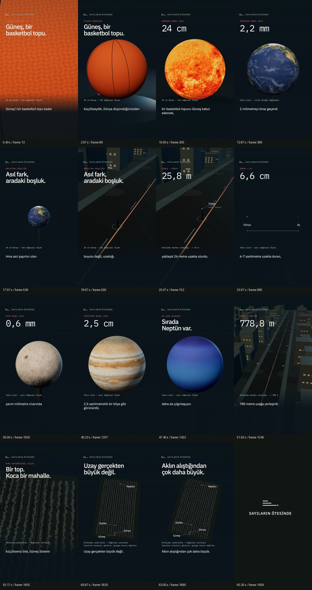

# Güneş Bir Basketbol Topu Olsaydı?

[gunes-basketbol.mp4](gunes-basketbol.mp4): 1080×1920, 30 FPS, 1.979 kare / 65,967 saniye. Tam kalite film, Antalia-2 Mini erkek sesi, ayrı yerel ambient/efekt miksajı, gömülü Türkçe altyazılar, değişmemiş 45 kare outro.

MP4, `renders/episodes/solar-basketball/draft.mp4` ile aynı dosyadır. “Taslak” kaliteyi değil henüz verilmemiş insan dinleme/altyazı onayını belirtir. Model güveni ve otomatik MP4 QA, insan incelemesi değildir. Video hiçbir sosyal platformda yayımlanmadı.

[Storyboard](../../public/episodes/solar-basketball/storyboard.md) · [SRT](../../public/episodes/solar-basketball/captions.srt) · [Kelime zamanları](../../public/episodes/solar-basketball/word-timings.json) · [QA](../../docs/episodes/solar-basketball/QA.md) · [MacBook yeniden üretimi](../../docs/episodes/solar-basketball/REPRODUCE.md).

Anlatıcı WAV’ı, ayrı müzik/efekt katmanları ve tam PCM miks Git dışındadır; yerel `public/episodes/solar-basketball/` klasöründedir. Ham Antalia WAV’ı `tts/outputs/episodes/solar-basketball/narration.wav`. Model ağırlıkları veya sanal ortamlar bu teslim paketine eklenmez.

Planetary textures: **Solar System Scope / INOVE**, [solarsystemscope.com/textures](https://www.solarsystemscope.com/textures/), [CC BY 4.0](https://creativecommons.org/licenses/by/4.0/). Rendered on 3D spheres with lighting and camera adjustments. Basketbol dokusu, şehir, ses efektleri ve müzik özgün kod üretimidir. [Kaynak ve lisanslar](../../docs/episodes/solar-basketball/SOURCES_AND_LICENSES.md).

